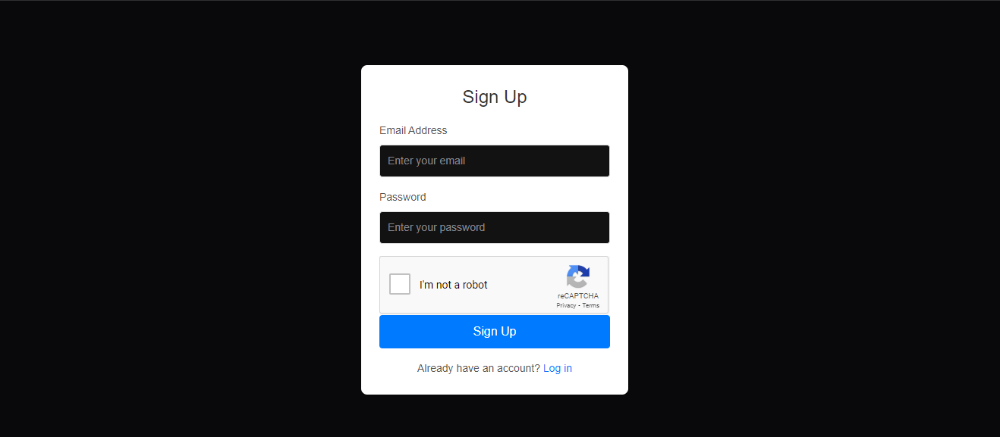
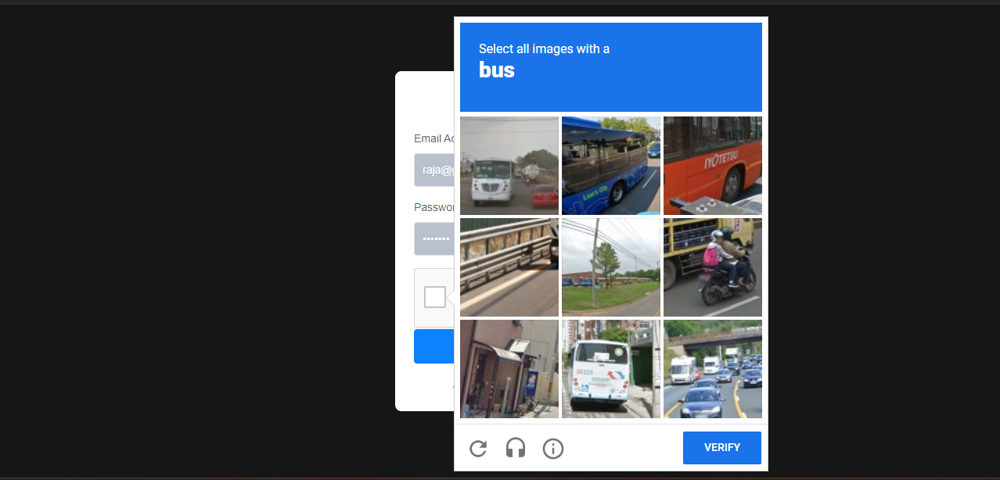
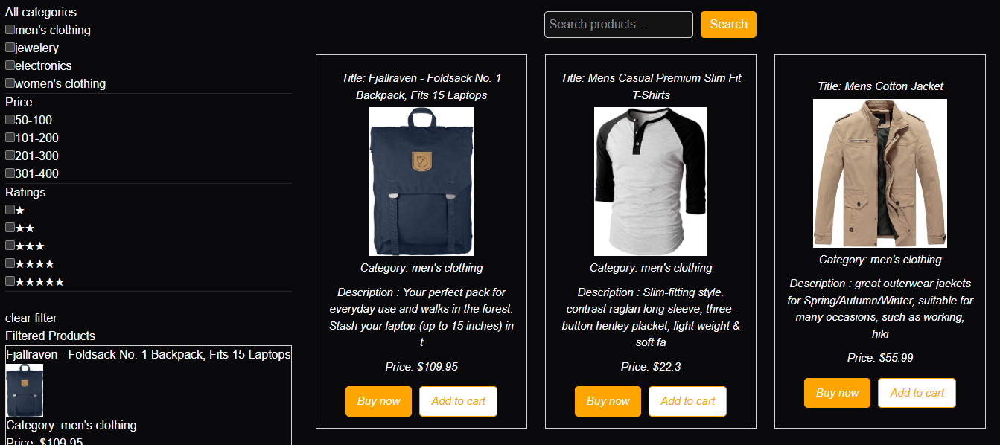
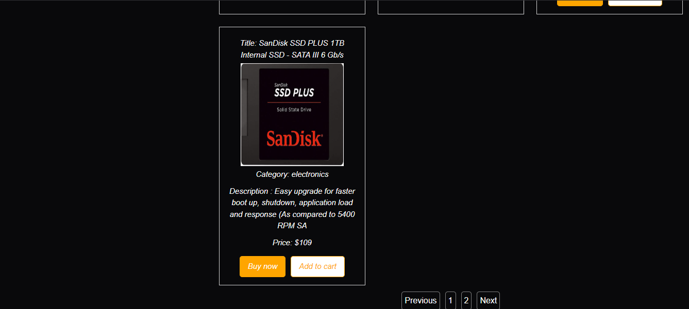

# React + Vite
ment Application

Description

The Products Management Application is a React-based web application that provides functionality to:

Search for products by title.

View products with pagination.

Drag and drop products to reorder them.

Interact with product cards (e.g., "Buy Now" and "Add to Cart" buttons).

The project demonstrates core React concepts and provides an intuitive user interface styled with CSS.

Features

Search Functionality: Real-time search to filter products by title.

Pagination: Navigate through product pages using "Previous," "Next," and page numbers.

Drag-and-Drop: Rearrange product positions interactively.

Interactive Product Cards: Display product details such as title, category, price, and an image.

Technology Stack

Frontend: React, CSS

State Management: React Hooks (useState, useEffect)

Project Structure

src/
|-- components/
|   |-- Products.js
|
|-- style/
|   |-- Product.css
|
|-- App.js
|-- index.js

Preview

Here is a preview of the UI:

Getting Started

Prerequisites

Ensure you have the following installed:

Node.js (v14+)

npm or yarn

Installation

Clone the repository:

git clone https://github.com/your-username/products-management-app.git

Navigate to the project folder:

cd products-management-app

Install the dependencies:

npm install

Running the Application

Start the development server:

npm start

The app will be available at http://localhost:3000.

Usage Instructions

Use the search bar to filter products by their title.

Navigate through different pages using the pagination controls.

Drag and drop a product card to reorder the list.

Click "Buy Now" or "Add to Cart" to simulate user actions.

Contributing

Contributions are welcome! If you'd like to improve this project, please fork the repository and submit a pull request.

Steps to Contribute:

Fork the repository.

Create a new branch for your feature or bug fix:

git checkout -b feature-name

Commit your changes:

git commit -m "Description of your changes"

Push to the branch:

git push origin feature-name

Open a pull request on GitHub.

License